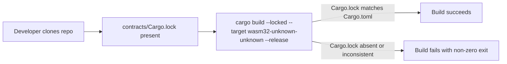

# Design Document: Cargo.lock Version Control

## Overview

This feature ensures `Cargo.lock` is committed to the repository and that CI builds use the exact locked dependency versions. The token-factory contract is a deployable binary artifact (`cdylib`), so Rust best practices require committing `Cargo.lock` for reproducible builds.

The change set is minimal and surgical:
1. Remove any `.gitignore` rules that suppress `Cargo.lock` within `contracts/`
2. Commit `contracts/Cargo.lock` to the repository
3. Add `--locked` to the `cargo build` invocation in `.github/workflows/wasm-build.yml`

## Architecture

The feature touches three files:

```
.gitignore                              # ensure no Cargo.lock ignore rule exists
contracts/Cargo.lock                    # add to version control (generate if absent)
.github/workflows/wasm-build.yml        # add --locked flag to cargo build step
```

No new components, services, or abstractions are introduced. This is a repository hygiene change.



## Components and Interfaces

### .gitignore

Current state: no rule suppresses `Cargo.lock` (confirmed — the file only ignores `node_modules/`, `dist/`, `.env`, `.env.local`, `*.local`).

Required state: same — no action needed on `.gitignore` unless a rule is added in the future.

### contracts/Cargo.lock

Generated by running `cargo generate-lockfile` (or any `cargo build`/`cargo check`) inside the `contracts/` workspace. Once generated, the file is committed and tracked by Git.

The lock file records the exact resolved version of every dependency in the workspace, including transitive ones. For the token-factory crate this includes `soroban-sdk`, `soroban-token-sdk`, `proptest`, and all their transitive dependencies.

### .github/workflows/wasm-build.yml

The `Build wasm` step currently runs:
```
cargo build --target wasm32-unknown-unknown --release --manifest-path contracts/token-factory/Cargo.toml
```

It must be updated to:
```
cargo build --locked --target wasm32-unknown-unknown --release --manifest-path contracts/token-factory/Cargo.toml
```

The `--locked` flag instructs Cargo to use only the versions recorded in `Cargo.lock` and to fail if the lock file is absent or inconsistent with `Cargo.toml`.

## Data Models

### Cargo.lock structure (informational)

`Cargo.lock` is a TOML file managed entirely by Cargo. Its schema is:

```toml
# This file is automatically @generated by Cargo.
# It is not intended for manual editing.
version = 3

[[package]]
name = "token-factory"
version = "0.1.0"
dependencies = [
  "soroban-sdk 21.x.x ...",
  ...
]

[[package]]
name = "soroban-sdk"
version = "21.x.x"
source = "registry+https://github.com/rust-lang/crates.io-index"
checksum = "<sha256>"
dependencies = [...]
```

No application-level data model changes are required. The lock file is an opaque artifact from Cargo's perspective.

## Correctness Properties

*A property is a characteristic or behavior that should hold true across all valid executions of a system — essentially, a formal statement about what the system should do. Properties serve as the bridge between human-readable specifications and machine-verifiable correctness guarantees.*

### Property 1: Cargo.lock is present and tracked

*For any* fresh clone of the repository, the file `contracts/Cargo.lock` SHALL exist on disk and SHALL be tracked by Git (i.e., `git ls-files contracts/Cargo.lock` returns a non-empty result).

**Validates: Requirements 1.2, 1.3**

### Property 2: .gitignore does not suppress Cargo.lock

*For any* state of the `.gitignore` file, no pattern in it SHALL cause Git to ignore `Cargo.lock` files under the `contracts/` directory.

**Validates: Requirements 1.1**

### Property 3: CI build uses --locked flag

*For any* invocation of the WASM build CI job, the `cargo build` command SHALL include the `--locked` flag, ensuring dependency resolution is constrained to the versions in `Cargo.lock`.

**Validates: Requirements 2.1**

### Property 4: CI fails on missing or inconsistent Cargo.lock

*For any* CI run where `Cargo.lock` is absent or where `Cargo.toml` specifies dependencies inconsistent with `Cargo.lock`, the build step SHALL exit with a non-zero status code.

**Validates: Requirements 2.2**

## Error Handling

| Scenario | Behavior |
|---|---|
| `Cargo.lock` absent in CI | `cargo build --locked` exits non-zero; CI job fails and reports the error |
| `Cargo.lock` inconsistent with `Cargo.toml` | `cargo build --locked` exits non-zero with message "Cargo.lock needs to be updated" |
| `.gitignore` accidentally re-adds a Cargo.lock rule | `git status` will show `contracts/Cargo.lock` as untracked; developer must remove the rule |

No runtime error handling is needed — all failure modes surface at build/CI time.

## Testing Strategy

This feature is a repository configuration change, not application logic. Testing is therefore structural and CI-based rather than unit/property-based in the traditional sense.

### Unit / Example Tests (shell-level checks)

These can be run locally or in a separate CI lint job:

1. **Gitignore check**: Assert that `git check-ignore -v contracts/Cargo.lock` returns a non-zero exit code (meaning the file is NOT ignored).
2. **Lock file presence**: Assert that `git ls-files --error-unmatch contracts/Cargo.lock` succeeds (file is tracked).
3. **CI flag check**: Assert that `wasm-build.yml` contains the string `--locked`.

### Property-Based Tests

The properties in this feature are structural/configuration properties rather than algorithmic ones. They are best validated by the CI pipeline itself:

- **Property 1 & 2**: Validated by the presence of `contracts/Cargo.lock` in the Git tree and the absence of a suppressing `.gitignore` rule. These are checked on every CI run via `git ls-files`.
- **Property 3 & 4**: Validated by the CI job itself — if `--locked` is present and `Cargo.lock` is committed and consistent, the build passes; otherwise it fails.

**Property-Based Testing Library**: Not applicable for this feature. The correctness properties are configuration invariants verified by Cargo's own `--locked` enforcement and Git's tracking mechanism, not algorithmic properties requiring randomized input generation.

**CI as the test harness**: Every push to `main` or PR targeting `main` exercises Properties 3 and 4 automatically via the updated `wasm-build.yml`.
