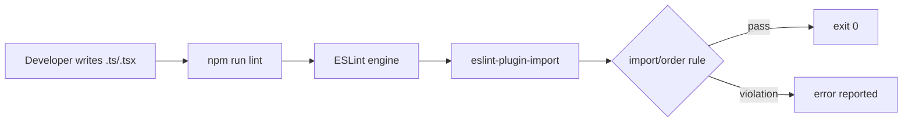

# Design Document: ESLint Import Order Rule

## Overview

This feature adds consistent import ordering enforcement to the frontend TypeScript/React project. It installs `eslint-plugin-import`, configures the `import/order` rule in `.eslintrc.cjs`, and auto-fixes all existing violations. The result is a lint configuration that enforces group-based import ordering on every lint run.

No new application code is introduced. All changes are to configuration files and existing source files (import statement reordering only).

## Architecture

The change is purely in the ESLint toolchain layer. The runtime application is unaffected.



## Components and Interfaces

### eslint-plugin-import

- npm package: `eslint-plugin-import`
- Compatible version range: `^2.29.0` (supports ESLint 8.x)
- Provides the `import/order` rule used for group enforcement

### .eslintrc.cjs changes

Two additions to the existing config:

1. Add `'import'` to the `plugins` array
2. Add the `import/order` rule to the `rules` object:

```js
'import/order': [
  'error',
  {
    groups: ['builtin', 'external', 'internal', 'parent', 'sibling', 'index'],
    'newlines-between': 'always',
  },
],
```

### Import Group Definitions

| Group | Examples |
|-------|---------|
| `builtin` | `node:fs`, `node:path` |
| `external` | `react`, `react-dom`, third-party packages |
| `internal` | Path aliases (e.g. `@/components/...`) |
| `parent` | `../utils`, `../../hooks` |
| `sibling` | `./Button`, `./styles` |
| `index` | `./` (index file imports) |

## Data Models

No new data models. The only structured data is the ESLint rule configuration object, which is a plain JavaScript object literal in `.eslintrc.cjs`.

## Correctness Properties

*A property is a characteristic or behavior that should hold true across all valid executions of a system — essentially, a formal statement about what the system should do. Properties serve as the bridge between human-readable specifications and machine-verifiable correctness guarantees.*

### Property 1: Out-of-order imports trigger a violation

*For any* TypeScript or TSX file whose import statements are not arranged in the configured group order (`builtin` → `external` → `internal` → `parent` → `sibling` → `index`), running ESLint against that file SHALL produce at least one `import/order` error.

**Validates: Requirements 2.5, 4.3**

### Property 2: Auto-fix eliminates all import/order violations

*For any* TypeScript or TSX file, after `eslint --fix` is applied, running ESLint against that file SHALL report zero `import/order` violations.

**Validates: Requirements 3.1, 3.2, 3.3**

## Error Handling

- If `eslint-plugin-import` is not installed, ESLint will fail with a "Definition for rule 'import/order' was not found" error. This is caught immediately on first lint run and resolved by running `npm install`.
- If a file contains dynamic imports or `require()` calls, `import/order` does not apply to those statements and they are ignored by the rule.
- The `--max-warnings 0` flag in `npm run lint` means any warning-level violation also fails the lint run. The rule is configured at `'error'` severity to be consistent with this policy.

## Testing Strategy

This feature is configuration-only. Testing focuses on verifying the ESLint rule behaves correctly rather than testing application logic.

### Unit / Example Tests (vitest)

- Verify `frontend/package.json` contains `eslint-plugin-import` in `devDependencies`
- Verify `.eslintrc.cjs` includes `'import'` in `plugins`
- Verify `.eslintrc.cjs` defines `import/order` with `'error'` severity, correct groups array, and `newlines-between: 'always'`

### Property-Based Tests (vitest + fast-check)

Property tests use fast-check to generate TypeScript import blocks and run them through ESLint programmatically via the ESLint Node.js API (`new ESLint({ fix: false })`).

**Property 1 test** — generate import blocks with randomly shuffled group order, lint them, assert at least one `import/order` error is reported.
- Tag: `Feature: eslint-import-order, Property 1: out-of-order imports trigger a violation`
- Minimum 100 iterations

**Property 2 test** — generate import blocks with randomly shuffled group order, apply `eslint --fix` programmatically, lint the fixed output, assert zero `import/order` errors remain.
- Tag: `Feature: eslint-import-order, Property 2: auto-fix eliminates all import/order violations`
- Minimum 100 iterations

Both property tests use the ESLint Node.js API so they run entirely in-process without spawning child processes.
