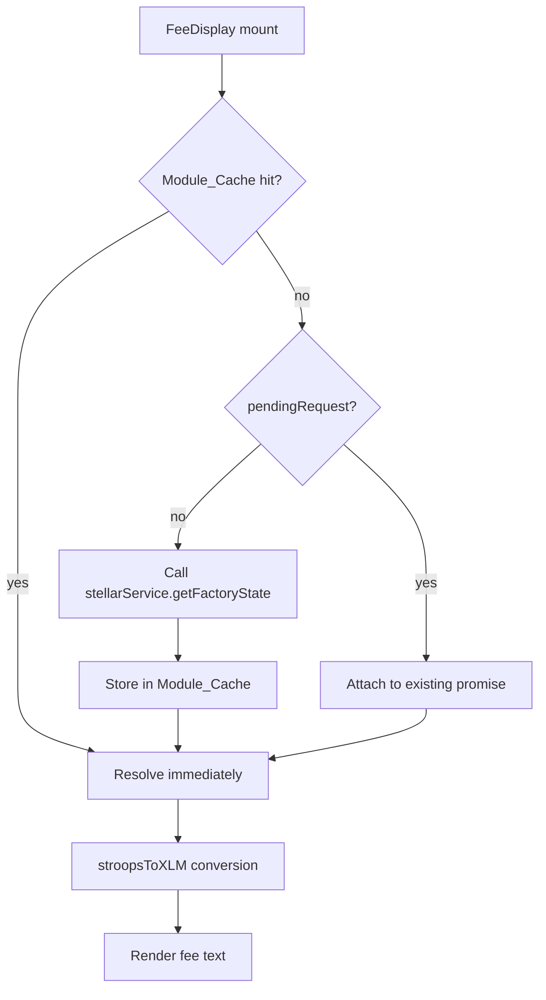

# Design Document: FeeDisplay Component

## Overview

`FeeDisplay` is a small, self-contained React component that renders a labeled fee amount in XLM. It fetches factory state once via `stellarService.getFactoryState()`, converts the raw stroops value to XLM, and displays it. A module-level cache prevents duplicate RPC calls across multiple mounted instances.

## Architecture



The component has three render states:
1. **Loading** — promise pending, skeleton shown
2. **Loaded** — XLM value available, fee text shown
3. **Error** — fetch failed, unavailable message shown

## Components and Interfaces

### FeeDisplay

```typescript
interface FeeDisplayProps {
  feeType: 'base' | 'metadata'
  className?: string
}
```

- Accepts `feeType` to select which fee from `FactoryState` to display.
- Accepts an optional `className` for layout customisation by the parent.
- Renders a `<span>` in all three states (loading, loaded, error).

### Module-level cache

```typescript
let cachedFactoryState: FactoryState | null = null
let pendingRequest: Promise<FactoryState> | null = null

function getFactoryState(): Promise<FactoryState>
```

- `cachedFactoryState` — stores the resolved state after the first successful fetch.
- `pendingRequest` — stores the in-flight promise so concurrent callers share it.
- `getFactoryState()` — the single entry point; returns a resolved promise if cached, attaches to the pending promise if one exists, or starts a new fetch otherwise.

### Dependencies

| Import | Purpose |
|---|---|
| `stellarService.getFactoryState()` | Fetches `{ baseFee, metadataFee }` in stroops |
| `stroopsToXLM(stroops)` | Converts stroops → XLM (`stroops / 10_000_000`) |

## Data Models

```typescript
// From frontend/src/services/stellar.ts
interface FactoryState {
  baseFee: number    // stroops
  metadataFee: number // stroops
}

// Label map
const LABELS: Record<'base' | 'metadata', string> = {
  base: 'Creation Fee',
  metadata: 'Metadata Fee',
}
```

## Correctness Properties

*A property is a characteristic or behavior that should hold true across all valid executions of a system — essentially, a formal statement about what the system should do. Properties serve as the bridge between human-readable specifications and machine-verifiable correctness guarantees.*

### Property 1: Stroops-to-XLM conversion is always applied

*For any* valid `baseFee` or `metadataFee` value (non-negative integer stroops), after the factory state resolves, the rendered text must contain the value produced by `stroopsToXLM(stroops)`.

**Validates: Requirements 1.1, 2.3**

### Property 2: Output format is always "{Label}: {amount} XLM"

*For any* `feeType` in `{ 'base', 'metadata' }` and any non-negative stroops value, the rendered text must match the pattern `"{Label}: {xlm} XLM"` where `{Label}` is the correct label for that `feeType`.

**Validates: Requirements 1.2, 1.3, 1.4**

### Property 3: Cache prevents duplicate RPC calls

*For any* sequence of N ≥ 1 calls to `getFactoryState()` after the first fetch has resolved, the underlying `stellarService.getFactoryState` must be called exactly once regardless of N.

**Validates: Requirements 3.1**

### Property 4: Error state renders unavailable message for all feeTypes

*For any* `feeType` in `{ 'base', 'metadata' }`, when `stellarService.getFactoryState` rejects, the rendered text must be `"{Label}: unavailable"`.

**Validates: Requirements 4.1**

## Error Handling

| Scenario | Behaviour |
|---|---|
| `getFactoryState()` rejects | `error` state set to `true`; renders `"{Label}: unavailable"` |
| Component unmounts before fetch resolves | `cancelled` flag prevents `setState` calls; no memory leak |
| Concurrent mounts before first fetch | `pendingRequest` deduplicates; only one RPC call made |

## Testing Strategy

### Dual Testing Approach

Both unit tests and property-based tests are used — they are complementary.

- **Unit tests** cover specific examples, ARIA attributes, and edge cases.
- **Property tests** verify universal correctness across randomly generated inputs.

### Property-Based Testing

Library: **fast-check** (already in the project).

Each property test runs a minimum of **100 iterations**.

Tag format: `Feature: fee-display, Property {N}: {property_text}`

| Property | Test description |
|---|---|
| Property 1 | Generate random non-negative integer stroops; mock service; assert rendered text contains `stroopsToXLM(stroops)` |
| Property 2 | Generate random stroops + random feeType; assert rendered text matches `"{Label}: {xlm} XLM"` |
| Property 3 | Call `getFactoryState()` N times (N generated 1–20); assert spy called exactly once |
| Property 4 | Generate random feeType; mock service to reject; assert rendered text is `"{Label}: unavailable"` |

### Unit Tests

- Loading skeleton renders with `role="status"` and correct `aria-label` (Requirement 2.2)
- `feeType='base'` renders `"Creation Fee: 7 XLM"` for 70000000 stroops (Requirement 1.2)
- `feeType='metadata'` renders `"Metadata Fee: 1 XLM"` for 10000000 stroops (Requirement 1.3)
- Concurrent mounts share a single in-flight request (Requirement 3.2)
