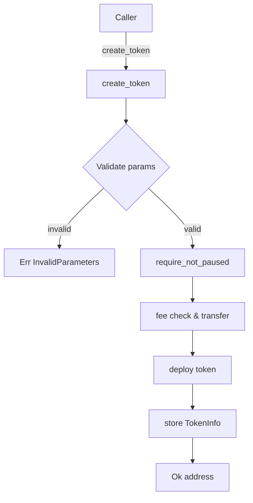

# Design Document

## Overview

This feature adds input validation to the `create_token` entry point of the `TokenFactory` Soroban smart contract. Currently `Error::InvalidParameters` is defined but never used, causing a dead-code warning and allowing callers to pass nonsensical values. The change is minimal: a validation block is inserted at the top of `create_token` that checks each caller-supplied parameter and returns `Error::InvalidParameters` early if any check fails.

No new types, storage keys, or external dependencies are introduced. The fix is entirely contained within `contracts/token-factory/src/lib.rs` and its companion test file `contracts/token-factory/src/test.rs`.

## Architecture

The contract follows a single-file, flat architecture typical of Soroban contracts. All logic lives in `lib.rs`; tests live in `test.rs` (included via `mod test`).



The validation block is the first thing that runs inside `create_token`, before the pause check and before any auth or fee logic. This is the cheapest possible rejection path.

## Components and Interfaces

### Validation block (new code in `create_token`)

```rust
// Parameter validation — runs before any auth, fee, or storage access
if name.len() == 0 {
    return Err(Error::InvalidParameters);
}
if symbol.len() == 0 {
    return Err(Error::InvalidParameters);
}
if decimals > 18 {
    return Err(Error::InvalidParameters);
}
if initial_supply < 0 {
    return Err(Error::InvalidParameters);
}
```

`soroban_sdk::String` exposes a `.len() -> u32` method, so the empty-string check is a direct SDK call with no allocation. The `decimals > 18` check is a plain `u32` comparison. The `initial_supply < 0` check is a plain `i128` comparison.

### Error enum (unchanged)

`Error::InvalidParameters = 3` already exists. No changes to the enum are needed.

### Test additions (`test.rs`)

Five new `#[test]` functions are added to the existing test module, one per acceptance criterion in Requirement 6:

| Test name | Parameter under test | Input | Expected result |
|---|---|---|---|
| `test_create_token_rejects_empty_name` | `name` | `""` | `Err(Ok(Error::InvalidParameters))` |
| `test_create_token_rejects_empty_symbol` | `symbol` | `""` | `Err(Ok(Error::InvalidParameters))` |
| `test_create_token_rejects_decimals_19` | `decimals` | `19` | `Err(Ok(Error::InvalidParameters))` |
| `test_create_token_accepts_decimals_18` | `decimals` | `18` | result ≠ `Err(Ok(Error::InvalidParameters))` |
| `test_create_token_rejects_negative_supply` | `initial_supply` | `-1` | `Err(Ok(Error::InvalidParameters))` |

## Data Models

No new data models are introduced. The existing `TokenInfo`, `FactoryState`, and `Error` types are unchanged.

The only observable state change is that `create_token` now returns `Err(Error::InvalidParameters)` for previously-accepted (but semantically invalid) inputs. No new storage keys are written.

## Correctness Properties

*A property is a characteristic or behavior that should hold true across all valid executions of a system — essentially, a formal statement about what the system should do. Properties serve as the bridge between human-readable specifications and machine-verifiable correctness guarantees.*


### Property 1: Empty name is always rejected

*For any* call to `create_token` where `name` is an empty string (and all other parameters are otherwise valid), the contract SHALL return `Err(Error::InvalidParameters)` and no token SHALL be deployed.

**Validates: Requirements 1.1**

### Property 2: Empty symbol is always rejected

*For any* call to `create_token` where `symbol` is an empty string (and all other parameters are otherwise valid), the contract SHALL return `Err(Error::InvalidParameters)` and no token SHALL be deployed.

**Validates: Requirements 2.1**

### Property 3: Decimals above 18 are always rejected

*For any* `decimals` value greater than 18 (i.e., any `u32` in the range 19..=u32::MAX), a call to `create_token` SHALL return `Err(Error::InvalidParameters)` and no token SHALL be deployed.

**Validates: Requirements 3.1**

### Property 4: Negative initial supply is always rejected

*For any* `initial_supply` value less than 0 (i.e., any negative `i128`), a call to `create_token` SHALL return `Err(Error::InvalidParameters)` and no token SHALL be deployed.

**Validates: Requirements 4.1**

### Property 5: All-valid parameters are not rejected by validation

*For any* call to `create_token` where `name` is non-empty, `symbol` is non-empty, `decimals` is in 0..=18, and `initial_supply` is ≥ 0, the contract SHALL NOT return `Err(Error::InvalidParameters)`. (The call may still fail for other reasons such as insufficient fee, but not due to parameter validation.)

**Validates: Requirements 1.2, 2.2, 3.2, 4.2, 4.3**

## Error Handling

All validation errors return `Error::InvalidParameters` (discriminant 3). The contract returns early before any auth check, fee transfer, or storage write, so invalid calls are cheap and leave no side effects.

| Condition | Error returned |
|---|---|
| `name.len() == 0` | `Error::InvalidParameters` |
| `symbol.len() == 0` | `Error::InvalidParameters` |
| `decimals > 18` | `Error::InvalidParameters` |
| `initial_supply < 0` | `Error::InvalidParameters` |

No new error variants are introduced. All other existing error paths (`InsufficientFee`, `ContractPaused`, etc.) are unaffected.

## Testing Strategy

### Dual Testing Approach

Both unit tests and property-based tests are used. Unit tests cover the specific examples mandated by Requirement 6. Property-based tests verify the universal properties above across a wide range of generated inputs.

### Unit Tests (in `contracts/token-factory/src/test.rs`)

Five unit tests are added, one per acceptance criterion in Requirement 6:

```rust
#[test]
fn test_create_token_rejects_empty_name() { ... }

#[test]
fn test_create_token_rejects_empty_symbol() { ... }

#[test]
fn test_create_token_rejects_decimals_19() { ... }

#[test]
fn test_create_token_accepts_decimals_18() { ... }

#[test]
fn test_create_token_rejects_negative_supply() { ... }
```

Unit tests focus on the exact boundary values specified in the requirements (empty string, `decimals = 19`, `decimals = 18`, `initial_supply = -1`).

### Property-Based Tests

The Rust property-based testing library used is **`proptest`** (crate `proptest = "1"`), which integrates cleanly with `no_std`-compatible test harnesses via its `std` feature. Each property test runs a minimum of **100 iterations**.

Each test is tagged with a comment referencing the design property it validates:

```
// Feature: invalid-parameters-validation, Property N: <property text>
```

Property test outline:

```rust
// Feature: invalid-parameters-validation, Property 1: Empty name is always rejected
proptest! {
    #[test]
    fn prop_empty_name_rejected(symbol in "[a-zA-Z]{1,12}", decimals in 0u32..=18, supply in 0i128..=1_000_000) {
        let (env, client, ..) = setup_env();
        let result = client.try_create_token(
            &Address::generate(&env),
            &String::from_str(&env, ""),   // empty name
            &String::from_str(&env, &symbol),
            &decimals,
            &supply,
            &1000,
        );
        prop_assert_eq!(result, Err(Ok(Error::InvalidParameters)));
    }
}

// Feature: invalid-parameters-validation, Property 2: Empty symbol is always rejected
proptest! { ... }

// Feature: invalid-parameters-validation, Property 3: Decimals above 18 are always rejected
proptest! {
    #[test]
    fn prop_decimals_above_18_rejected(decimals in 19u32..=u32::MAX) { ... }
}

// Feature: invalid-parameters-validation, Property 4: Negative initial supply is always rejected
proptest! {
    #[test]
    fn prop_negative_supply_rejected(supply in i128::MIN..=-1i128) { ... }
}

// Feature: invalid-parameters-validation, Property 5: All-valid parameters are not rejected by validation
proptest! {
    #[test]
    fn prop_valid_params_not_rejected_by_validation(
        name in "[a-zA-Z]{1,32}",
        symbol in "[a-zA-Z]{1,12}",
        decimals in 0u32..=18,
        supply in 0i128..=1_000_000,
    ) {
        // result may be Err for other reasons (fee, etc.) but NOT InvalidParameters
        ...
        prop_assert_ne!(result, Err(Ok(Error::InvalidParameters)));
    }
}
```

`proptest` is added to `[dev-dependencies]` in `contracts/token-factory/Cargo.toml`. Tests are run with `cargo test -p token-factory`.
