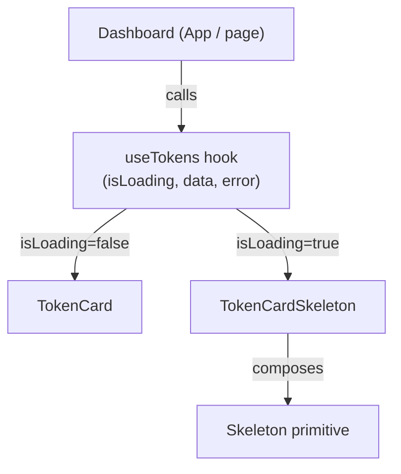

# Design Document: Skeleton Loaders

## Overview

This feature adds skeleton loading placeholders to the StellarForge frontend to improve perceived performance during data fetching. The implementation introduces a generic `Skeleton` primitive, a `TokenCardSkeleton` composite, and integrates them into the dashboard's loading state.

The project uses React 19, TypeScript, Tailwind CSS v4, and Vitest with `fast-check` already installed for property-based testing.

### Key Design Decisions

- **CSS-only animation**: Tailwind's `animate-pulse` utility (backed by `@keyframes pulse`) drives the animation — no JavaScript timers.
- **Composition over configuration**: `TokenCardSkeleton` is built by composing `Skeleton` primitives rather than accepting a generic "shape" config, keeping each component simple and readable.
- **`aria-hidden` at the primitive level**: Accessibility suppression is applied once in `Skeleton` and inherited by all composites, avoiding repetition.
- **Fixed placeholder count**: The dashboard renders 6 skeletons during loading to keep the grid visually stable and avoid cumulative layout shift (CLS).

---

## Architecture



The dashboard is the sole integration point. It reads `isLoading` and `error` from `useTokens` and conditionally renders either real `TokenCard` components or a fixed grid of `TokenCardSkeleton` placeholders.

---

## Components and Interfaces

### `Skeleton` — primitive

```tsx
interface SkeletonProps {
  variant?: 'text' | 'rect' | 'circle'  // default: 'rect'
  width?: string | number
  height?: string | number
  className?: string
}
```

Renders a `<div>` with:
- `aria-hidden="true"` always
- `bg-gray-200 animate-pulse` base classes
- Shape classes derived from `variant`:
  - `text` → `rounded-full` + default height `1em`
  - `circle` → `rounded-full` + equal width/height
  - `rect` → no border-radius override
- Inline `style` for `width`/`height` when provided as numbers (converted to `px`) or strings passed through directly
- `prefers-reduced-motion` handled via Tailwind's `motion-reduce:animate-none` modifier

### `TokenCardSkeleton` — composite

```tsx
interface TokenCardSkeletonProps {
  className?: string
}
```

Renders a card container matching `TokenCard`'s outer shell (`bg-white shadow rounded-lg`) and fills it with `Skeleton` primitives:
- Title row: `rect` skeleton ~60% width, `h-5`
- Symbol row: `text` skeleton ~30% width
- Data row: `rect` skeleton ~80% width, `h-4`

### Dashboard loading integration

The dashboard (currently `App.tsx`, or a future `Dashboard` component) will:
1. Call `useTokens()` to get `{ isLoading, data, error }`
2. Render an `aria-live="polite"` region that announces "Loading tokens" when `isLoading` is true and updates when loading completes
3. When `isLoading` is true: render `Array(6).fill(null).map((_, i) => <TokenCardSkeleton key={i} />)` in the grid
4. When `isLoading` is false and `data` is available: render `TokenCard` components
5. When `error` is set: render an error message, no skeletons

### `useTokens` hook (new)

```ts
interface UseTokensResult {
  data: TokenInfo[] | null
  isLoading: boolean
  error: string | null
}

function useTokens(): UseTokensResult
```

This hook does not exist yet and will be created as part of this feature to drive the dashboard integration.

---

## Data Models

No new persistent data models are introduced. The feature is purely presentational.

### `SkeletonVariant` type

```ts
type SkeletonVariant = 'text' | 'rect' | 'circle'
```

### Prop interfaces (see Components section above)

The `TokenInfo` type already exists in `frontend/src/types/index.ts` and is reused as-is.

---

## Correctness Properties

*A property is a characteristic or behavior that should hold true across all valid executions of a system — essentially, a formal statement about what the system should do. Properties serve as the bridge between human-readable specifications and machine-verifiable correctness guarantees.*

### Property 1: Skeleton always hides from assistive technology

*For any* combination of valid `SkeletonProps` (any variant, any width, any height, any className), the rendered root element must always have `aria-hidden="true"`.

**Validates: Requirements 1.7, 5.1**

---

### Property 2: Skeleton forwards dimensions and className

*For any* non-empty `className` string and any numeric or string `width`/`height` values, the rendered `Skeleton` root element must contain the provided className and reflect the provided dimensions in its style or class attributes.

**Validates: Requirements 1.2**

---

### Property 3: Circle variant enforces equal dimensions

*For any* size value passed as both `width` and `height` to a `Skeleton` with `variant="circle"`, the rendered element must have `border-radius: 50%` (via `rounded-full`) and the width and height must be equal.

**Validates: Requirements 1.3**

---

### Property 4: TokenCardSkeleton forwards className to root

*For any* non-empty `className` string passed to `TokenCardSkeleton`, the root element of the rendered output must include that className.

**Validates: Requirements 2.3**

---

### Property 5: Dashboard renders skeletons iff loading

*For any* mock `useTokens` state, the dashboard renders `TokenCardSkeleton` elements if and only if `isLoading` is `true` (and `error` is null). When `isLoading` is `false` and data is present, no skeleton elements appear.

**Validates: Requirements 3.1, 3.2**

---

### Property 6: Error state suppresses skeletons

*For any* non-null error value returned by `useTokens`, the dashboard must render zero `TokenCardSkeleton` elements and must render an error message.

**Validates: Requirements 3.4**

---

### Property 7: aria-live region updates on load completion

*For any* transition from `isLoading=true` to `isLoading=false` (with any data payload), the dashboard's `aria-live` region must update its content to reflect that loading has completed.

**Validates: Requirements 5.3**

---

## Error Handling

| Scenario | Behavior |
|---|---|
| `useTokens` returns `error` | Dashboard renders error message; no skeletons rendered |
| `useTokens` returns `isLoading=false, data=null` | Dashboard renders empty state (no skeletons, no cards) |
| Invalid `variant` prop on `Skeleton` | TypeScript compile-time error; falls back to `rect` at runtime if needed |
| `width`/`height` props are `0` or negative | Rendered element may be invisible; no crash |

The `Skeleton` component itself has no async operations and therefore no network error surface. All error handling lives in the dashboard's consumption of `useTokens`.

---

## Testing Strategy

### Dual Testing Approach

Both unit tests and property-based tests are required. Unit tests cover specific examples and edge cases; property tests verify universal invariants across generated inputs.

### Property-Based Testing

The project already has `fast-check` installed (`"fast-check": "^4.5.3"` in `package.json`). Tests run in Vitest with jsdom.

Each property test must run a minimum of **100 iterations** (fast-check default is 100; do not lower it).

Each property test must include a comment tag in the format:
`// Feature: skeleton-loaders, Property N: <property text>`

| Property | Test description | fast-check arbitraries |
|---|---|---|
| P1: aria-hidden invariant | Generate random valid SkeletonProps; assert aria-hidden="true" always present | `fc.record({ variant: fc.constantFrom('text','rect','circle'), width: fc.option(fc.nat()), height: fc.option(fc.nat()), className: fc.option(fc.string()) })` |
| P2: className/dimension forwarding | Generate random className + dimensions; assert reflected in DOM | `fc.string({ minLength: 1 })`, `fc.nat()` |
| P3: circle equal dimensions | Generate random size; render circle; assert rounded-full and equal w/h | `fc.nat({ min: 10, max: 500 })` |
| P4: TokenCardSkeleton className forwarding | Generate random className; assert on root element | `fc.string({ minLength: 1 })` |
| P5: Dashboard loading switch | Generate mock useTokens states; assert skeleton presence matches isLoading | `fc.boolean()` combined with mock data arrays |
| P6: Error suppresses skeletons | Generate random error strings; assert zero skeletons | `fc.string({ minLength: 1 })` |
| P7: aria-live updates on completion | Simulate loading→loaded transition; assert aria-live text changes | `fc.array(fc.record({ name: fc.string(), symbol: fc.string() }))` |

### Unit Tests (examples and edge cases)

- `Skeleton` renders `animate-pulse` class
- `Skeleton` with `variant="text"` has `rounded-full`
- `Skeleton` with `variant="rect"` has no rounded class
- `Skeleton` root element is a `<div>` with `bg-gray-200`
- `TokenCardSkeleton` renders at least 3 `Skeleton` children (title, symbol, data row)
- `TokenCardSkeleton` root has same container classes as `TokenCard`
- Dashboard renders exactly 6 skeletons when `isLoading=true`
- Dashboard renders `aria-live` region with "Loading tokens" when `isLoading=true`
- `prefers-reduced-motion`: Skeleton has `motion-reduce:animate-none` class (edge case — mock media query in jsdom)

### Test File Locations

```
frontend/src/components/UI/
  Skeleton.test.tsx
  TokenCardSkeleton.test.tsx
frontend/src/
  Dashboard.test.tsx   (or App.test.tsx if dashboard stays in App)
```
