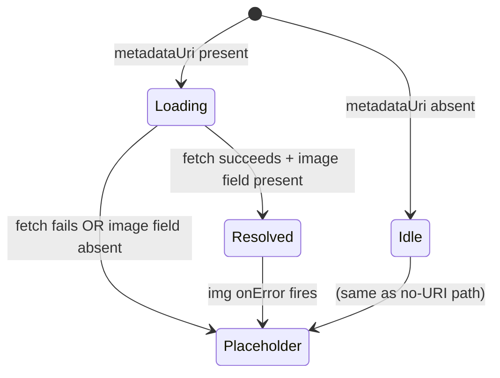

# Design Document: Token Metadata Display

## Overview

`TokenMetadata` is a React/TypeScript component that accepts a token's `name`, `symbol`, and optional `metadataUri`. When a URI is present it fetches the metadata JSON via the existing `ipfsService`, extracts the image URL and description, and renders them. In all failure paths (no URI, fetch error, missing image field, broken image URL) it falls back to a static placeholder. Images are always lazy-loaded.

## Architecture

The component is self-contained and lives at `frontend/src/components/TokenMetadata.tsx`. It has no new dependencies beyond what already exists in the project.

```
TokenMetadata (component)
  ├── uses ipfsService.getMetadata()   (frontend/src/services/ipfs.ts)
  ├── uses IPFS_CONFIG.pinataGateway   (frontend/src/config/ipfs.ts)
  ├── uses Spinner                     (frontend/src/components/UI/Spinner.tsx)
  └── renders img / placeholder img
```

State machine (internal):



## Components and Interfaces

### Props

```typescript
interface TokenMetadataProps {
  metadataUri?: string   // ipfs:// URI or any URL; absent/empty → placeholder
  name: string           // always displayed
  symbol: string         // always displayed
  className?: string     // forwarded to root element
}
```

### Internal state

```typescript
type FetchState =
  | { status: 'idle' }
  | { status: 'loading' }
  | { status: 'resolved'; imageUrl: string; description?: string }
  | { status: 'error' }
```

### Key behaviours

- `metadataUri` is considered absent when it is `undefined` or an empty string after trimming.
- On mount (or when `metadataUri` changes) the component calls `ipfsService.getMetadata(uri)`. Any rejection transitions to `status: 'error'`.
- If the returned object has no `image` field the component also transitions to `status: 'error'` (placeholder shown).
- The `` element's `onError` handler transitions from `resolved` to `error`.
- Both the token image and the placeholder carry `loading="lazy"`.

## Data Models

### Metadata_Object (returned by ipfsService)

The service currently returns `any`. The component will treat the response as:

```typescript
interface TokenMetadataResponse {
  image?: string        // URL or ipfs:// URI
  name?: string
  description?: string
}
```

No changes to `frontend/src/types/index.ts` are required; this interface is local to the component file.

## Correctness Properties

*A property is a characteristic or behavior that should hold true across all valid executions of a system — essentially, a formal statement about what the system should do. Properties serve as the bridge between human-readable specifications and machine-verifiable correctness guarantees.*

---

**Property 1: Image rendered from metadata**
*For any* non-empty `metadataUri` where `ipfsService.getMetadata()` resolves to an object with a non-empty `image` field, the component should render an `` element whose `src` is derived from that image value.
**Validates: Requirements 1.1**

---

**Property 2: Description rendered from metadata**
*For any* non-empty `metadataUri` where `ipfsService.getMetadata()` resolves to an object with a non-empty `description` field, the component should render that description string as visible text in the DOM.
**Validates: Requirements 1.2**

---

**Property 3: Name and symbol always present**
*For any* combination of `name`, `symbol`, and metadata fetch outcome (success, failure, or absent URI), the rendered output should contain both the `name` and `symbol` strings.
**Validates: Requirements 1.4**

---

**Property 4: Placeholder on missing or failed metadata**
*For any* render where `metadataUri` is absent/empty, OR where `ipfsService.getMetadata()` rejects, OR where the resolved object has no `image` field, the component should render the placeholder `` element (identifiable by a `data-testid="placeholder-image"` attribute) with a non-empty `alt` attribute.
**Validates: Requirements 2.1, 2.2, 2.3, 3.1, 3.3**

---

**Property 5: All images are lazy-loaded**
*For any* render state (token image or placeholder), every `` element rendered by the component should carry `loading="lazy"`.
**Validates: Requirements 4.1, 4.2**

## Error Handling

| Scenario | Behaviour |
|---|---|
| `metadataUri` absent or empty | Skip fetch; render placeholder immediately |
| `ipfsService.getMetadata()` rejects | Catch error; transition to `error` state; render placeholder |
| Resolved object has no `image` field | Transition to `error` state; render placeholder |
| `` `onError` fires | Transition to `error` state; render placeholder |

No error text is surfaced to the user. Errors are silently swallowed after logging to `console.error` for debugging.

## Testing Strategy

**Dual testing approach** — unit tests for specific examples and edge cases; property-based tests for universal properties.

### Unit tests (vitest + @testing-library/react)

- Loading spinner is shown while fetch is in-flight (example: pending promise).
- `onError` on the image element swaps to placeholder (example: fire synthetic error event).
- Empty string `metadataUri` shows placeholder without calling the service (edge case).

### Property-based tests (vitest + fast-check)

Each property test runs a minimum of **100 iterations**.

Each test is tagged with a comment in the format:
`// Feature: token-metadata-display, Property N: <property text>`

| Property | Test description |
|---|---|
| Property 1 | Generate random URIs + image URLs; assert `` matches resolved image |
| Property 2 | Generate random description strings; assert text appears in rendered output |
| Property 3 | Generate random name/symbol pairs across all fetch states; assert both appear |
| Property 4 | Generate all failure inputs (undefined, empty, rejection, no-image object); assert placeholder with non-empty alt |
| Property 5 | Across all render states; assert every `` has `loading="lazy"` |
