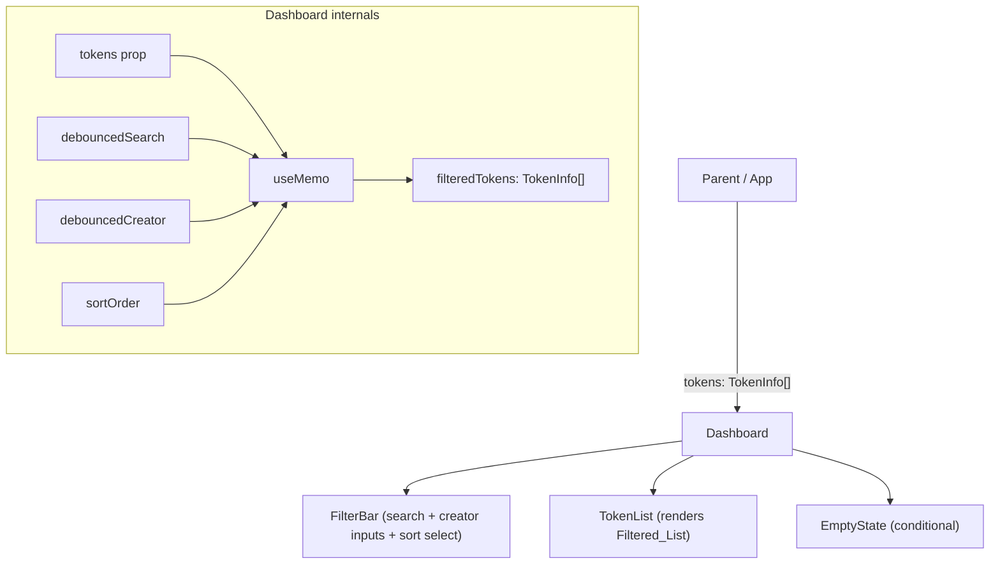

# Design Document: Token Search, Filter, and Sort

## Overview

This feature adds client-side search, filter, and sort controls to the `Dashboard` component. The current `Dashboard` makes an RPC call on every keystroke to look up a single token by address. The new implementation replaces that with a prop-fed `TokenInfo[]` list and derives a `Filtered_List` entirely in memory using `useMemo`, `useState`, and the existing `useDebounce` hook.

No new network calls are introduced. All filtering and sorting runs synchronously against the in-memory token list, keeping the UI responsive even for lists up to 500 tokens.

## Architecture



The `Dashboard` component owns all filter/sort state. The parent simply passes the full token list as a prop. The derived `filteredTokens` value is computed with `useMemo` so React only re-runs the filter/sort logic when its inputs change.

## Components and Interfaces

### Dashboard (refactored)

```tsx
interface DashboardProps {
  tokens: TokenInfo[]
}
```

Responsibilities:
- Holds `searchQuery`, `creatorFilter`, and `sortOrder` state
- Debounces the two text inputs at 300 ms via `useDebounce`
- Derives `filteredTokens` with `useMemo`
- Renders `FilterBar`, `TokenList` or `EmptyState`

### FilterBar (new, internal)

A presentational sub-component (or inline JSX block) that renders:
- `<Input label="Search by name or symbol" />` — bound to `searchQuery`
- `<Input label="Filter by creator address" />` — bound to `creatorFilter`
- `<select>` (or equivalent) with options: `newest` | `oldest` | `alphabetical` — bound to `sortOrder`

### TokenList (existing rendering logic, extracted)

Renders the `filteredTokens` array as a list of token cards.

### EmptyState (inline or small component)

Renders one of two messages:
- `"No tokens match your search."` — when `filteredTokens` is empty and at least one filter is active
- `"No tokens have been deployed yet."` — when `filteredTokens` is empty and no filter is active

## Data Models

### SortOrder

```ts
type SortOrder = 'newest' | 'oldest' | 'alphabetical'
```

### FilterState (internal to Dashboard)

```ts
interface FilterState {
  searchQuery: string      // raw input value
  creatorFilter: string    // raw input value
  sortOrder: SortOrder
}
```

The debounced counterparts (`debouncedSearch`, `debouncedCreator`) are derived from `useDebounce` and fed into `useMemo`.

### Filtering Logic (pseudocode)

```ts
const filteredTokens = useMemo(() => {
  let list = [...tokens]

  if (debouncedSearch) {
    const q = debouncedSearch.toLowerCase()
    list = list.filter(t =>
      t.name.toLowerCase().includes(q) ||
      t.symbol.toLowerCase().includes(q)
    )
  }

  if (debouncedCreator) {
    const c = debouncedCreator.toLowerCase()
    list = list.filter(t => t.creator.toLowerCase().includes(c))
  }

  switch (sortOrder) {
    case 'oldest':
      list = list.reverse()   // assumes tokens arrive newest-first from parent
      break
    case 'alphabetical':
      list = list.sort((a, b) => a.name.localeCompare(b.name))
      break
    // 'newest' is the default order from the parent — no-op
  }

  return list
}, [tokens, debouncedSearch, debouncedCreator, sortOrder])
```

Note: "newest first" is the default because the parent is expected to provide tokens in reverse-chronological order (most recently deployed first). If the parent order cannot be guaranteed, the `TokenInfo` type should be extended with an index or timestamp field. For now the design assumes parent-provided order is newest-first.


## Correctness Properties

*A property is a characteristic or behavior that should hold true across all valid executions of a system — essentially, a formal statement about what the system should do. Properties serve as the bridge between human-readable specifications and machine-verifiable correctness guarantees.*

### Property 1: Search filter correctness

*For any* token list and any non-empty search query, every token in the filtered result must have a `name` or `symbol` that contains the query as a case-insensitive substring, and no token that fails this condition should appear in the result.

**Validates: Requirements 1.3**

### Property 2: Creator filter correctness

*For any* token list and any non-empty creator filter string, every token in the filtered result must have a `creator` field that contains the filter string as a case-insensitive substring, and no token that fails this condition should appear in the result.

**Validates: Requirements 2.3**

### Property 3: Combined filter conjunction

*For any* token list, search query, and creator filter, every token in the filtered result must satisfy both the search condition (name/symbol match) and the creator condition simultaneously — no token that fails either condition should appear.

**Validates: Requirements 2.5**

### Property 4: Debounce delays filter update

*For any* text input change to the search or creator fields, the filtered list must not update before 300 ms have elapsed since the last keystroke, but must update after 300 ms.

**Validates: Requirements 1.2, 2.2**

### Property 5: Newest-first and oldest-first are inverses

*For any* token list, sorting by "oldest first" should produce the exact reverse of sorting by "newest first" (assuming the parent provides tokens in newest-first order).

**Validates: Requirements 3.3, 3.4**

### Property 6: Alphabetical sort ordering invariant

*For any* token list sorted alphabetically, for every adjacent pair of tokens `(a, b)` in the result, `a.name.localeCompare(b.name) <= 0` must hold.

**Validates: Requirements 3.5**

### Property 7: Clearing filters restores full list

*For any* token list and any combination of active filters, clearing all filters (setting search query and creator filter to empty strings) must result in the filtered list being equal to the full token list (in the default sort order).

**Validates: Requirements 1.4, 2.4, 4.4**

### Property 8: No RPC calls on filter or sort change

*For any* sequence of search query, creator filter, or sort order changes, the network/RPC layer must not be invoked — all results must be derived from the in-memory token list.

**Validates: Requirements 1.5, 5.1**

## Error Handling

- If the `tokens` prop is `undefined` or `null` (e.g., parent hasn't loaded yet), `Dashboard` treats it as an empty array and shows the "No tokens have been deployed yet." message.
- Filter inputs accept any string; no validation is needed since substring matching on an arbitrary string is always well-defined.
- `localeCompare` handles Unicode and special characters gracefully for alphabetical sort.
- If `TokenInfo.creator` is an empty string, the creator filter with a non-empty query will correctly exclude that token (empty string does not contain a non-empty substring).

## Testing Strategy

### Unit Tests (Vitest + React Testing Library)

Focus on specific examples, edge cases, and integration points:

- Render `Dashboard` with an empty token list → assert "No tokens have been deployed yet." message
- Render `Dashboard` with tokens, type a query that matches nothing → assert "No tokens match your search." message
- Render `Dashboard` with tokens, type a query that matches some → assert only matching tokens are shown
- Assert the sort select defaults to "Newest first" on initial render
- Assert all three sort options are present in the select control
- Assert search and creator inputs are labeled correctly

### Property-Based Tests (fast-check)

Use [fast-check](https://github.com/dubzzz/fast-check) for property-based testing. Each test runs a minimum of 100 iterations.

**Property 1 — Search filter correctness**
```
// Feature: token-search-filter, Property 1: search filter correctness
fc.assert(fc.property(
  fc.array(arbTokenInfo), fc.string({ minLength: 1 }),
  (tokens, query) => {
    const result = applyFilters(tokens, query, '', 'newest')
    return result.every(t =>
      t.name.toLowerCase().includes(query.toLowerCase()) ||
      t.symbol.toLowerCase().includes(query.toLowerCase())
    )
  }
), { numRuns: 100 })
```

**Property 2 — Creator filter correctness**
```
// Feature: token-search-filter, Property 2: creator filter correctness
fc.assert(fc.property(
  fc.array(arbTokenInfo), fc.string({ minLength: 1 }),
  (tokens, creator) => {
    const result = applyFilters(tokens, '', creator, 'newest')
    return result.every(t =>
      t.creator.toLowerCase().includes(creator.toLowerCase())
    )
  }
), { numRuns: 100 })
```

**Property 3 — Combined filter conjunction**
```
// Feature: token-search-filter, Property 3: combined filter conjunction
fc.assert(fc.property(
  fc.array(arbTokenInfo), fc.string(), fc.string(),
  (tokens, query, creator) => {
    const result = applyFilters(tokens, query, creator, 'newest')
    return result.every(t => {
      const matchesSearch = !query ||
        t.name.toLowerCase().includes(query.toLowerCase()) ||
        t.symbol.toLowerCase().includes(query.toLowerCase())
      const matchesCreator = !creator ||
        t.creator.toLowerCase().includes(creator.toLowerCase())
      return matchesSearch && matchesCreator
    })
  }
), { numRuns: 100 })
```

**Property 5 — Newest-first and oldest-first are inverses**
```
// Feature: token-search-filter, Property 5: newest-oldest inverse
fc.assert(fc.property(
  fc.array(arbTokenInfo),
  (tokens) => {
    const newest = applyFilters(tokens, '', '', 'newest')
    const oldest = applyFilters(tokens, '', '', 'oldest')
    return JSON.stringify(oldest) === JSON.stringify([...newest].reverse())
  }
), { numRuns: 100 })
```

**Property 6 — Alphabetical sort ordering invariant**
```
// Feature: token-search-filter, Property 6: alphabetical sort invariant
fc.assert(fc.property(
  fc.array(arbTokenInfo),
  (tokens) => {
    const sorted = applyFilters(tokens, '', '', 'alphabetical')
    for (let i = 0; i < sorted.length - 1; i++) {
      if (sorted[i].name.localeCompare(sorted[i + 1].name) > 0) return false
    }
    return true
  }
), { numRuns: 100 })
```

**Property 7 — Clearing filters restores full list**
```
// Feature: token-search-filter, Property 7: clearing filters restores full list
fc.assert(fc.property(
  fc.array(arbTokenInfo), fc.string(), fc.string(),
  (tokens, query, creator) => {
    const cleared = applyFilters(tokens, '', '', 'newest')
    return JSON.stringify(cleared) === JSON.stringify(tokens)
  }
), { numRuns: 100 })
```

**Property 8 — No RPC calls on filter change**

Implemented as a unit test using `vi.spyOn` on `stellarService` — assert the spy is never called when filter state changes are applied to a pre-loaded token list.

### Test File Location

`frontend/src/test/Dashboard.test.tsx` — covers both unit and property-based tests.

The `applyFilters` pure function (extracted from the `useMemo` body) is the primary unit under test for properties, making tests fast and deterministic without needing to render the full component for every iteration.
